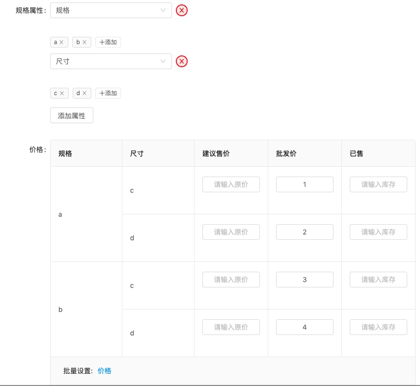

# react-antd-sku

[在线案例](https://codesandbox.io/s/react-antd-sku-nopor)


```jsx
<Sku
  ref={this.skuRef}
  form={form}
  label1="规格属性"
  label2="价格"
  formItemLayout={{
    labelCol: {
      span: 4
    },
    wrapperCol: {
      span: 20
    }
  }}
  useDefaultButton={false}
  skuPropsList={skuPropsList}
  skuPropVoList={propVoList}
  addTagApi={this.addTagApi}
  filterSku={skuTags => {
    let k = skuTags
      .map(tag => tag.id)
      .sort()
      .join(":");
    let sku = skuData.filter(sku => {
      let k1 = sku.tags.sort().join(":");
      return k === k1;
    });
    return sku[0];
  }}
  extras={[
    {
      title: "建议售价",
      dataIndex: "preprice",
      width: 150,
      render: (v, record, row) => {
        return this.renderBaseFormItem({
          key: `${record.rowKey}.preprice`,
          config: {
            initialValue: v
          },
          el: (
            <Input
              style={{
                padding: 0,
                textAlign: "center"
              }}
              placeholder="请输入原价"
            />
          )
        });
      }
    }
  ]}
  footer={() => (
    <p>
      <span style={{ margin: "0 10px" }}>批量设置:</span>
      <a
        href="void:javascript(0)"
        type="link"
        onClick={() => {
          this.setState(
            {
              dialogTitle: "价格",
              dialogOpt: "price"
            },
            () => {
              this.dialog.current.show();
            }
          );
          return false;
        }}
      >
        价格
      </a>
    </p>
  )}
  onChange={v => {
    this.setState({
      tmpSkuProps: v.tmpSkuProps,
      skuTableColumns: v.skuTableColumns,
      skuTableDataSource: v.skuTableDataSource
    });
  }}
/>
```

### API

| 参数             | 说明                                            | 类型                   | 默认值 | 案例                                                         |
| ---------------- | ----------------------------------------------- | ---------------------- | ------ | ------------------------------------------------------------ |
| title            | 表格头部 , 同antd Table                         | Function               |        | ()=>"表头"                                                   |
| footer           | 表格尾部 ,同antd Table                          | Function               |        | ()=><p>Footer</p>                                            |
| useDefaultButton | 使用默认的"添加属性" 按钮                       |                        | TRUE   |                                                              |
| extras           | 拓展sku 列                                      | Function=>Array\|[]    |        |                                                              |
| form             | 接管 sku 内 form                                |                        |        |                                                              |
| skuPropsList     | 属性列表                                        | Array                  |        | [     { id: 4, propertyName: "规格"}, ]                      |
| skuPropVoList    | 显示数据时, 属性及其tag                         | Array                  |        | [         {           id: 4,           propertyName: "规格",           tagList: [             {               id: 1,               tagName: "a"             }           ]        } ] |
| addTagApi        | tag 添加时api                                   | Function=>Promise      |        |                                                              |
| filterSku        | 显示 sku 表格时,根据 sku 组合 查找指定 sku 数据 | Function=> sku         |        |                                                              |
| onChange         | sku 更新时事件, 传出表格所有数据                |                        |        |                                                              |
| 事件             | 说明                                            |                        |        |                                                              |
| reset            | 重置 sku 设计区                                 | Function               |        |                                                              |
| addOneProp       | 添加一个属性选择框                              | Function               |        |                                                              |
| refreshSKUTable  | 刷新 sku 表格                                   | Function               |        |                                                              |
| setCurrentProp   | 新增属性时 设置回显到选择框                     | Function( propertyId ) |        |                                                              |
|                  |                                                 |                        |        |                                                              |